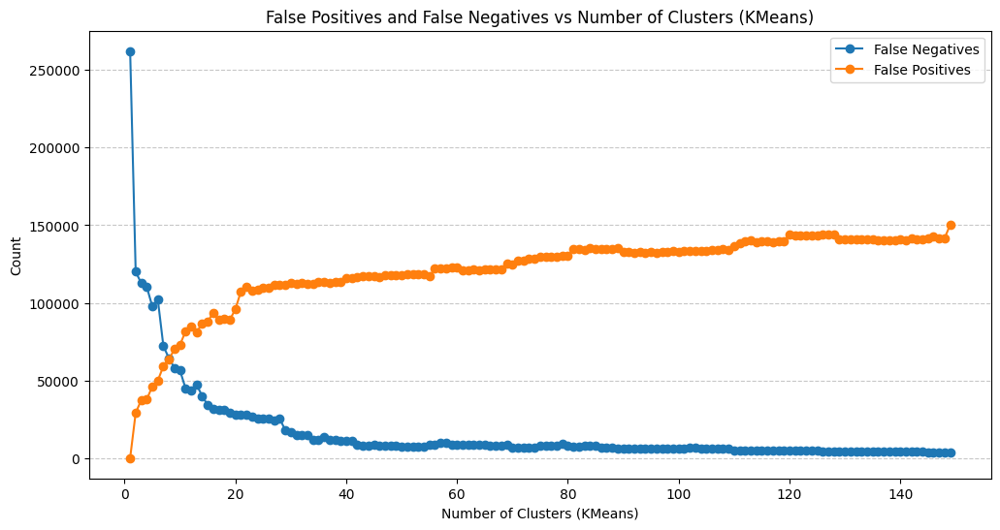

# Repo, którego celem jest reprodukcja 2 sposobów znajdywania sklonowanych części kodu. - Zrobione
# Dalszy cel, który został odkryty po analizie danych. Naprawa datasetu BigCloneBench. Dataset ten zawiera dużo przykładów nie oznaczonych jako klony, mimo, że są klonami typu 4.

Aktualnie najlepiej działające podejście: grupowanie (KNN) po embeddingach krótkich opisów kawałków kodu wygenerowanych przez LLM.

False positives - przykłady oznaczone w datasecie jako klony, a klasteryzacja twierdzi inaczej
False negatives - przykłady oznaczone w datasecie jako nie klony, a klasteryzacja twierdzi inaczej
Rozmiar datasetu - 540 000 rekordów

Typy klonów kodu:
- Type-1 (textual similarity): Code fragments that are identical, except for variations in white space, layout, and
comments.
- Type-2 (lexical similarity): Code fragments that are identical, except for variations in identifier names and lexical
values, in addition to the differences in Type-1 clones.
- Type-3 (syntactic similarity): Code snippets that exhibit
syntactic similarities but at the statement level. Alongside
Type-1 and Type-2 clone differences, these fragments may
have added, modified, or removed statements relative to
one another.
- Type-4 (semantically similarity): Code fragments that are
syntactically dissimilar but implement the same functionality.
